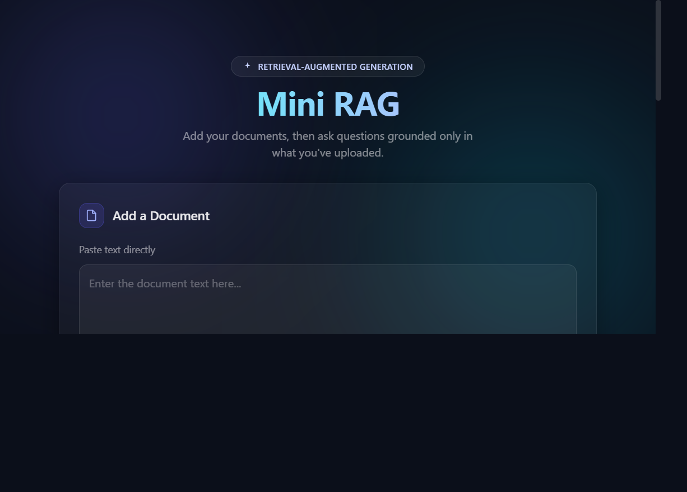

# Mini RAG

**A full-stack retrieval-augmented generation app for asking grounded questions about your documents.** Upload a PDF, TXT, or DOCX, retrieve relevant passages with Gemini embeddings, and generate an answer with source text.

**Live app:** [mini-rag-app-delta.vercel.app](https://mini-rag-app-delta.vercel.app) · **API health:** [Render](https://mini-rag-app-1-dlst.onrender.com/health) · **API docs:** [Swagger UI](https://mini-rag-app-1-dlst.onrender.com/docs)



## Product Overview

Mini RAG demonstrates an end-to-end document question-answering workflow across a Next.js client, a FastAPI service, and hosted Gemini models. It supports both pasted text and document uploads, then returns an answer alongside the retrieved source documents.

### Highlights

- Upload `.pdf`, `.txt`, and `.docx` documents, or add text directly.
- Generate 768-dimensional document and query embeddings with Gemini's retrieval tasks.
- Rank documents by cosine similarity and return the top matching sources.
- Generate context-grounded answers with Gemini Flash.
- Keep model inference on hosted APIs; the backend does not load local PyTorch or Transformer models.
- Run the frontend on Vercel and the API on Render with configurable CORS.

## Architecture

```text
Browser (Next.js on Vercel)
        │  JSON + multipart requests
        ▼
FastAPI API (Render)
        ├── PDF / TXT / DOCX text extraction
        ├── Gemini Embeddings API ──► 768-D vectors
        ├── In-memory vector search ◄── cosine similarity
        └── Gemini Flash ──► grounded answer + sources
```

### Retrieval Flow

1. The API extracts text from an upload or accepts pasted text.
2. Gemini creates document embeddings using `RETRIEVAL_DOCUMENT`; long inputs are embedded in batches and averaged into one normalized vector per document.
3. Vectors and source text are stored in the process-local vector store.
4. Gemini embeds each query using `RETRIEVAL_QUERY`; cosine similarity ranks the stored documents.
5. Gemini Flash receives the highest-ranked document text and is instructed to answer only from that context.

## Technology

| Layer | Technology |
| --- | --- |
| Web client | Next.js 15, React 19, Tailwind CSS 4 |
| API | Python, FastAPI, Uvicorn |
| Embeddings | Gemini Embedding API (`gemini-embedding-001`, 768 dimensions) |
| Answer generation | Gemini Flash (`gemini-3.8-flash` by default) |
| Vector ranking | NumPy cosine similarity |
| File extraction | PyPDF2, python-docx, UTF-8 text |
| Hosting | Vercel (frontend), Render (API) |

## Run Locally

### 1. Configure the API

Create `backend/.env` with your own Gemini API key:

```env
GEMINI_API_KEY=your_key_here
GEMINI_MODEL=gemini-3.8-flash
CORS_ORIGINS=http://localhost:3000
```

The same `GEMINI_API_KEY` is used for embeddings and answer generation. Keep the key private and out of source control.

### 2. Start the backend

```powershell
cd backend
python -m venv .venv
.\.venv\Scripts\Activate.ps1
pip install -r requirements.txt
uvicorn main:app --host 0.0.0.0 --port 8002 --reload
```

The API runs at `http://localhost:8002`; interactive API docs are at `http://localhost:8002/docs`.

### 3. Start the frontend

Create `mini-rag-frontend/.env.local`:

```env
NEXT_PUBLIC_BACKEND_URL=http://localhost:8002
```

Then run:

```powershell
cd mini-rag-frontend
npm install
npm run dev
```

Open `http://localhost:3000`.

## API

| Method | Endpoint | Description |
| --- | --- | --- |
| `GET` | `/health` | Service health check |
| `POST` | `/add_document` | Embed and store submitted text |
| `POST` | `/upload_document` | Extract, embed, and store an uploaded file |
| `POST` | `/query` | Return the most relevant documents |
| `POST` | `/generate_answer` | Return a grounded answer and source text |

Example request for `/generate_answer`:

```json
{
  "text": "What skills are listed on the resume?",
  "top_k": 3
}
```

The response includes `answer` and `sources` fields.

## Deployment

- **Vercel:** set the project root to `mini-rag-frontend` and configure `NEXT_PUBLIC_BACKEND_URL` to the Render API base URL.
- **Render:** use the root `render.yaml` blueprint. It builds from `backend/`, starts Uvicorn on Render's `$PORT`, and checks `/health`.
- **CORS:** configure `CORS_ORIGINS` with the exact deployed Vercel origin (no trailing slash). For multiple origins, separate them with commas.
- **Gemini:** configure `GEMINI_API_KEY` in Render. `GEMINI_MODEL` is optional; the code defaults to `gemini-3.8-flash` and maps the retired `gemini-2.5-flash` ID to that model.

## Tests

Run backend regression tests from the repository root:

```powershell
python -m unittest discover -s backend -p "test*.py"
```

Run frontend lint and production build:

```powershell
cd mini-rag-frontend
npm run lint
npm run build
```

## Current Scope

- The vector store is in memory; documents are cleared when the backend process restarts and are not shared across multiple instances.
- Document text is embedded in chunks, but retrieval returns the full stored document rather than independently ranked passages.
- Gemini API availability, quotas, and usage costs apply to both embeddings and answer generation.

These boundaries keep the project focused on the RAG workflow while making persistence, passage-level chunking, authentication, and automated deployment checks clear next steps.